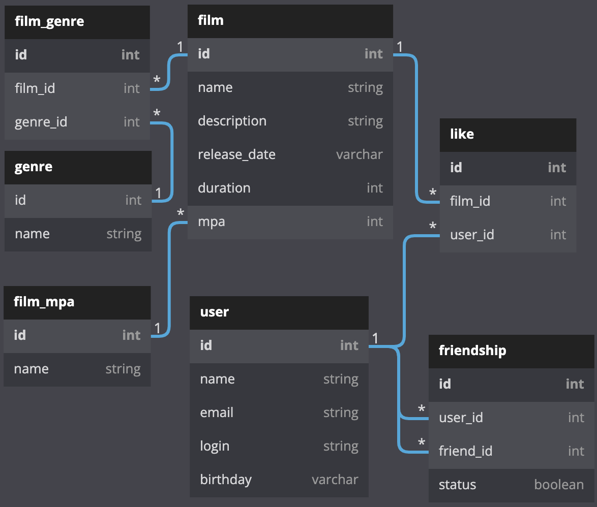

# java-filmorate
Template repository for Filmorate project.



## FilmRepository:

### getFilm:
```aidl
SELECT 
    f.id,
    f.name,
    f.description,
    f.release_date::date,
    f.duration,
    mpa.name AS mpa,
    string_agg(g.name,', ') AS genres
    COUNT(l.film_id) AS likes
FROM film AS f
WHERE f.id = #{id}
LEFT JOIN film_genre AS fg ON f.id = fg.film_id
LEFT JOIN genre AS g ON g.id = fg.genre_id
LEFT JOIN like AS l ON l.film_id = f.id
LEFT JOIN film_mpa AS mpa ON mpa.id = f.id
GROUP BY f.film_id
```

### getPopular:
```aidl
SELECT
    f.id,
    f.name,
    COUNT(l.film_id) AS rating
FROM like AS l
LEFT JOIN film AS f ON l.film_id = f.id
GROUP_BY l.film_id
ORDER BY rating DESC
LIMIT 10;
```

## UserRepository:

### getUser:
```aidl
SELECT 
    u.id,
    u.name,
    u.email,
    u.login,
    u.birthday::date
FROM user AS u
WHERE u.id = #{id}
```

### getFriends:
```aidl
SELECT
    u.id,
    u.name,
    u.login,
    u.email,
    u.birthday::date
FROM friendship AS f
LEFT JOIN user AS u ON u.id = f.user_id || u.id = f.friend_id
WHERE f.status IS TRUE AND (f.user_id = #{id} || f.friend_id=#{id})
```